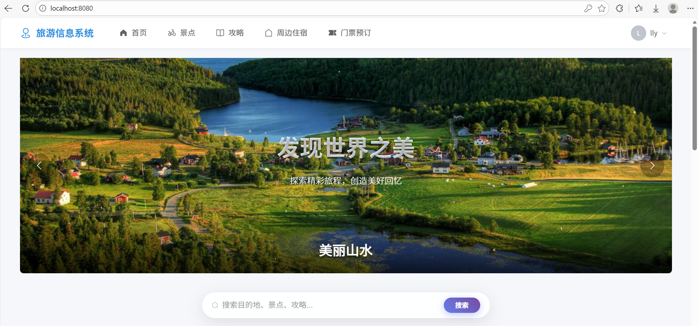
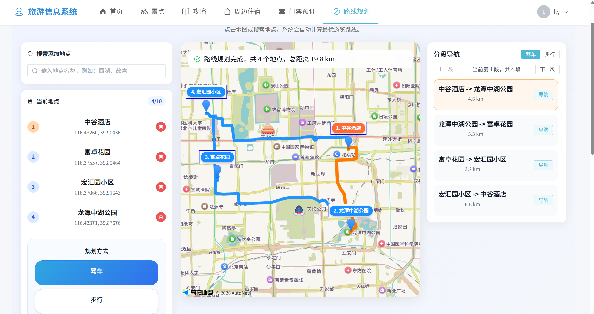

# Tourism Planning System

基于动态规划算法的旅游路线规划系统，采用前后端分离架构实现：

- `springboot/`：Spring Boot 后端
- `vue3/`：Vue 3 前端
- `db/`：数据库初始化脚本
- `docs/`：部署、环境变量、数据库导入等文档

适合作为课程设计、毕业设计或旅游信息系统项目参考。

## 功能特性

- 用户注册、登录、权限控制
- 景点、分类、轮播图、评论管理
- 旅游攻略展示与收藏
- 门票预订、住宿预订、订单管理
- 支付流程模拟
- 基于动态规划的旅游路线优化
- Redis 缓存与部分并发控制

## 技术栈

**后端**
- Java 17
- Spring Boot 3
- Spring Security
- MyBatis-Plus
- MySQL
- Redis
- Knife4j

**前端**
- Vue 3
- Vue Router
- Element Plus
- Pinia / Vuex
- Axios

## 系统截图

### 首页



### 周边住宿


### 路线规划



## 项目结构

```text
Tourism-Planning-System
├─ springboot
├─ vue3
├─ db
└─ docs
```

## 快速开始

### 1. 克隆项目

```bash
git clone https://github.com/lly710/Tourism-Planning-System.git
cd Tourism-Planning-System
```

### 2. 初始化数据库

```sql
CREATE DATABASE tourism_system DEFAULT CHARACTER SET utf8mb4;
```

导入初始化脚本：

```bash
mysql -u root -p tourism_system < db/tourism_system.sql
```

更多说明见：

- `docs/DB_IMPORT.md`

### 3. 配置后端

参考：

- `springboot/src/main/resources/application.properties`
- `springboot/src/main/resources/application.example.properties`

### 4. 启动后端

```bash
cd springboot
mvn spring-boot:run
```

默认端口：

- Backend: `1236`

### 5. 配置前端

参考：

- `vue3/.env.example`

### 6. 启动前端

```bash
cd vue3
npm install
npm run serve
```

## 必配环境变量

完整环境变量说明见：

- `docs/ENVIRONMENT.md`

至少需要配置：

- 后端数据库连接
- Redis 连接
- 邮箱 SMTP
- 高德地图 Key
- 阿里云 OSS
- 前端 `VUE_APP_BASE_API`
- 前端 `VUE_APP_AMAP_KEY`

## 部署文档

- 部署教程：`docs/DEPLOYMENT.md`
- 数据库导入：`docs/DB_IMPORT.md`
- 环境变量说明：`docs/ENVIRONMENT.md`

## 路线规划说明

项目核心亮点是旅游路线规划模块。后端通过动态规划算法计算多景点访问顺序，用于生成更优路线方案。

相关实现入口：

- `springboot/src/main/java/org/example/springboot/controller/RoutePlanningController.java:29`

## License

当前仓库暂未添加开源许可证。如需公开开源，建议补充 `MIT` 或 `Apache-2.0`。
